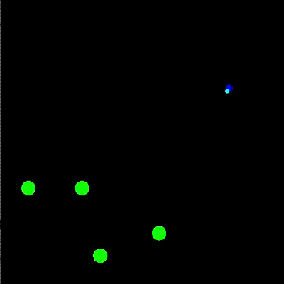

Bug
===

Teaching a bug to find food through various reinforcement learning algorithms. It gets RGB input through its eye consisting of 64 rays with a 120 degree field of view and can decide to turn left or right in every timestep.

(Generated with e9bf63f)

Build
-----
The project can be built with the provided CMake file in bug/. It depends on libtorch 1.5.0 and SFML 2.

Run
---
Running without arguments tries to load a network from qNet.pt and run a simulation. Passing -t retrains the network.
